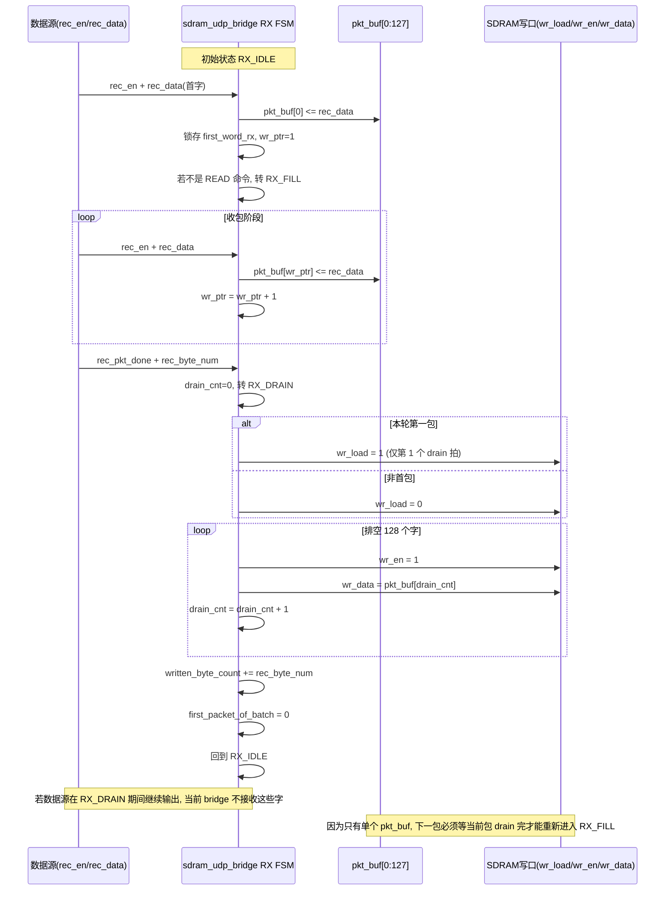

# 当前 Verilog / MATLAB 联调问题收束

## 1. 文档目的

本文档用于收束当前 FPGA UDP + SDRAM + MATLAB 回测链路中已经确认的问题、实验结论、根因判断和下一步修复预案。

目标是把以下信息固定下来：

1. 哪些现象已经被硬件实测确认
2. 哪些问题属于 MATLAB 解析侧
3. 哪些问题属于 Verilog 发送链路
4. 下一步应如何继续验证与修复

---

## 2. 当前系统基线

当前工程包含两条主要路径：

1. 写入路径：UDP 或内部 `gpio_stream_gen` -> `sdram_udp_bridge` -> SDRAM
2. 读回路径：SDRAM -> `sdram_udp_bridge` -> UDP -> MATLAB

当前联调过程中，写入数据源已切换到 `gpio_stream_gen`，MATLAB 通过 `udp_receive.m` / `udp_receive_GPIO_demo.m` 发出 `READ` 命令并回收数据。

---

## 3. 已确认的实验事实

### 3.1 固定值 GPIO 数据实验

实验方式：

1. 在 `gpio_stream_gen.v` 中将有效数据固定为 `24'hFFF000`
2. MATLAB 端按固定值 `int32(32'h00FFF000)` 比较

实验现象：

1. 当 MATLAB 端采用 `raw(3:130)` 解析时，会出现每 128 个点一次的周期性错误
2. 当 MATLAB 端采用 `raw(2:129)` **解析时，固定值读取可以通过**

结论：

1. 当前板上 bitstream 的实际回包格式，应以 `raw(2:129)` 为准
2. 当前真实回包布局与先前“两个 `pkt_idx` + 128 个数据字”的注释并不一致，Verilog端本身就是以`[pkt_idx][data][pkt_idx]`传输数据，存在bug；

### 3.2 递增 GPIO 数据实验

实验方式：

1. `gpio_stream_gen.v` 输出递增数据 `0, 1, 2, 3, ...`
2. MATLAB 端将回读值与递增向量直接比较

实测结果：

1. 前 127 个有效数据正确
2. 从第 128 个点开始整体偏移
3. MATLAB 实测输出示例：

```text
index: 128, received data is 145, should be 127
index: 129, received data is 146, should be 128
index: 130, received data is 147, should be 129
```

结论：

1. 问题不是单个点错误，而是从包边界开始整段错位
2. 第二包首值变成 `145` 而不是 `127`，说明跨包时累计丢失了固定数量的数据字
3. 当前观测结果表明，包边界处累计丢失约 18 个字

---

## 4. MATLAB 端问题整理

### 4.1 已经确认的问题

MATLAB 端曾出现的核心问题是：

1. 早期脚本对回包布局的假设不稳定
2. `raw(2:129)` 和 `raw(3:130)` 的选择直接影响边界是否出错

### 4.2 当前可执行结论

对当前这版硬件，MATLAB 端应按以下方式处理：

1. `udp_receive.m` 采用 `raw(2:129)` 作为当前 bitstream 的实际解析方式
2. 固定值实验已经证明，这样解析可以得到正确结果

### 4.3 MATLAB 端不再是主问题

当前阶段，MATLAB 解析已经不是主矛盾。原因是：

1. 固定值实验在 `raw(2:129)` 下能够通过
2. 递增值实验暴露的是跨包后整段错位，而不是单纯的 payload 切片问题

因此后续主要排查对象应转移到 Verilog 读回链路。

---

## 5. Verilog 端问题整理

### 5.0 `sdram_udp_bridge` 当前写入 SDRAM 的实际逻辑

基于当前已回撤后的 `rtl/sdram_udp_bridge.v`，写入链路应按下面这套真实逻辑理解，而不是按之前“GPIO 连续流可被无缝接收”的假设理解。

#### 写入状态机

RX 域只有一个 128 x 32bit 的单包缓存：

1. `RX_IDLE`
2. `RX_FILL`
3. `RX_DRAIN`

其行为如下：

1. 在 `RX_IDLE`，只要看到 `rec_en`，就把当前 `rec_data` 写到 `pkt_buf[0]`，并把 `first_word_rx` 锁存为首字。
2. 如果这一拍同时满足 `rec_pkt_done && rec_byte_num == 4 && rec_data == READ_CMD`，则该包被当作 `READ` 命令处理，不进入写 SDRAM 流程。
3. 否则状态机转入 `RX_FILL`，继续在每个 `rec_en` 有效拍把 `rec_data` 依次写入 `pkt_buf[wr_ptr]`，`wr_ptr` 自增。
4. 当 `rec_pkt_done` 到来时，说明当前整包已经收完，状态机把 `drain_cnt` 清零并转入 `RX_DRAIN`。
5. 在 `RX_DRAIN`，bridge 不再接收新的 `rec_data`，而是连续 128 拍把 `pkt_buf[0:127]` 依次送到 `wr_data`，同时拉高 `wr_en`。
6. 仅当 `drain_cnt == 0` 时，若 `first_packet_of_batch == 1`，才会把 `wr_load` 拉高 1 拍，用于通知 SDRAM 写地址回到 `wr_min_addr`。
7. 当 `drain_cnt == 127` 时，本包排空结束，`written_byte_count` 累加本包字节数，`first_packet_of_batch` 清零，状态机回到 `RX_IDLE`。

#### `wr_load`、`wr_en`、`written_byte_count` 的含义

1. `wr_load` 不是每包都拉高，而是“上电后的第一包”或“执行过一次 READ 后的新一轮首包”才拉高一次。
2. `wr_en` 只在 `RX_DRAIN` 阶段有效，表示 bridge 正把缓存包排入 SDRAM 写口。
3. `written_byte_count` 不是在 `RX_FILL` 期间累加，而是在整包 `RX_DRAIN` 结束时一次性加上 `rec_byte_num`。

#### 当前实现的关键约束

当前实现只有一个 `pkt_buf[0:127]`，因此 bridge 的工作方式是：

1. 先完整收完一包
2. 再完整排空这一包到 SDRAM
3. 排空结束后才重新准备接下一包

这意味着当前写入路径本质上不是“流式透传”，而是“单缓冲分包接收 + 单缓冲排空写入”。

### 5.1 `sdram_udp_bridge` 写入时序图

下面这个时序图描述的是当前代码下，GPIO/UDP 侧持续给数时，bridge 如何先填满 `pkt_buf`，再把 `pkt_buf` 排入 SDRAM，以及为什么在 `RX_DRAIN` 期间继续到来的数据会丢失。



### 5.2 结合当前波形的直接解释

结合本轮 SignalTap 现象，可以把错误机制进一步明确为：

1. `gpio_stream_gen` 输出的 `rec_data` 是连续递增的，这说明数据源本身没有断点。
2. `wr_data` 在第一包内是 `0..127`，说明 `pkt_buf` 的首包填充与 `RX_DRAIN` 排空本身是成立的。
3. 第二包 `wr_data` 从 `145` 开始，说明 bridge 在第一包 `RX_DRAIN` 期间没有接住后续输入，导致第二包开头若干字已经在上游流逝。
4. `wr_load` 只拉高一次是符合当前代码设计的，它只表示“新一轮首包回到 SDRAM 起始地址”，不是错误本身。

因此，当前写入侧最关键的结构性限制不是 `wr_load`，而是：

1. `pkt_buf` 只有一份
2. `RX_DRAIN` 期间没有继续收包能力
3. 上游若持续给数，就会在包与包之间产生丢字

### 5.3 `gpio_stream_gen.v`

当前结论：

1. `gpio_stream_gen.v` 已支持参数化数据模式
2. 固定值模式和递增模式都已用于硬件实测
3. 从当前实验结果看，`gpio_stream_gen` 不是主要根因

原因：

1. 固定值模式在 `raw(2:129)` 下能够正确回读
2. 递增模式暴露出的是明显的跨包偏移，而非数据生成本身不连续

### 5.4 `sdram_udp_bridge.v`

当前最关键的问题在该文件的 TX 读回打包逻辑。

重点代码位置：

1. `RD_LATENCY` 常量定义
2. `TX_RD_REQ` 状态下 `send_fifo_wrreq` / `rd_en` 的控制
3. `words_sent == 32'd0` 的首包特判逻辑

当前代码的设计假设是：

1. 首包需要处理读启动延迟
2. 后续包可以视为连续数据流，不再需要额外补偿

但硬件实验已经证明：

1. 首包之后的问题并未消失
2. 后续每个 128-word 包边界都仍存在偏移
3. 说明“仅首包需要补偿”的假设不成立

### 5.5 当前根因判断

当前最可信的 Verilog 根因判断是：

1. `sdram_udp_bridge.v` 在包与包之间重新进入 `TX_RD_REQ`
2. 每次新包启动时，底层 SDRAM 读口 / 读 FIFO 并非真正无缝连续
3. 代码却只对首包应用 `RD_LATENCY` 补偿
4. 导致后续包在启动阶段持续丢字，最终形成跨包累计偏移

---

## 6. 当前协议理解

当前板上 bitstream 的实际回包协议，应以“硬件实测优先”解释，而不是以旧注释优先。

当前更可信的实际回包结构是：

```text
raw(1)     = pkt_idx
raw(2:129) = 128 个有效数据字
raw(130)   = 非当前 MATLAB 数据比较所需字段
```

因此：

1. 当前 `raw(2:129)` 是现阶段稳定工作基线
2. 后续若修改 Verilog 协议，应同步更新 MATLAB 注释与解析方式

---

## 7. 下一步解决预案

### 7.1 第一阶段：先修复 Verilog 读回包边界问题

目标：消除递增数据在第 128 个点后整体错位的问题。

建议修改方向：

1. 修改 `sdram_udp_bridge.v` 的 `TX_RD_REQ` 逻辑
2. 不再只对首包应用 `RD_LATENCY` 补偿
3. 每个 128-word 包都按真实读链路启动延迟处理

预期收益：

1. 第二包首值应从 `145` 回到 `127`
2. 第三包、第四包不再继续累计偏移

### 7.2 第二阶段：保留 MATLAB 基线，避免同时改两端协议

建议：

1. 在 Verilog 修复完成前，MATLAB 继续使用 `raw(2:129)`
2. 不要同时改 MATLAB 解析和 Verilog 协议

原因：

1. 需要先保证当前 bitstream 的真实行为可重复验证
2. 否则会同时引入两端变更，难以判断是哪一侧起作用

### 7.3 第三阶段：完成回归验证矩阵

Verilog 修复后，建议按以下顺序回归：

1. 固定值 `24'hFFF000`，1e3 点
2. 固定值 `24'hFFF000`，1e5 点
3. 递增值 `0:1:N-1`，1e3 点
4. 递增值 `0:1:N-1`，1e5 点
5. 10M points 压力测试

每次记录以下指标：

1. 首个错误索引
2. 错误总数
3. 是否呈现固定周期错误
4. 错误值是否具有明显模式

### 7.4 第四阶段：协议清理

当 Verilog 读回链路稳定后，再做协议清理：

1. 统一 `sdram_udp_bridge.v` 注释
2. 统一 `udp_receive.m` 注释
3. 明确回包中 `pkt_idx` 和 payload 的正式布局
4. 将“当前实际协议”写回 README 和分析文档

---

## 8. 当前收束结论

当前阶段已经可以明确：

1. GPIO 数据生成不是当前主问题
2. MATLAB 解析在 `raw(2:129)` 下可以作为当前工作基线
3. 真正需要修复的是 `sdram_udp_bridge.v` 的按包读回逻辑
4. 当前最核心的错误机制是：后续包边界没有获得与首包一致的读延迟补偿，导致跨包持续偏移

后续应优先修复 Verilog 包边界读回时序，再进行大规模回归验证。