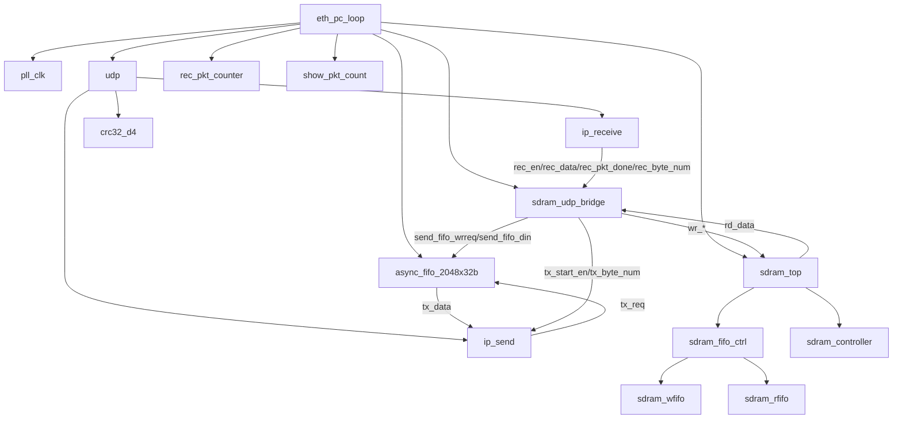
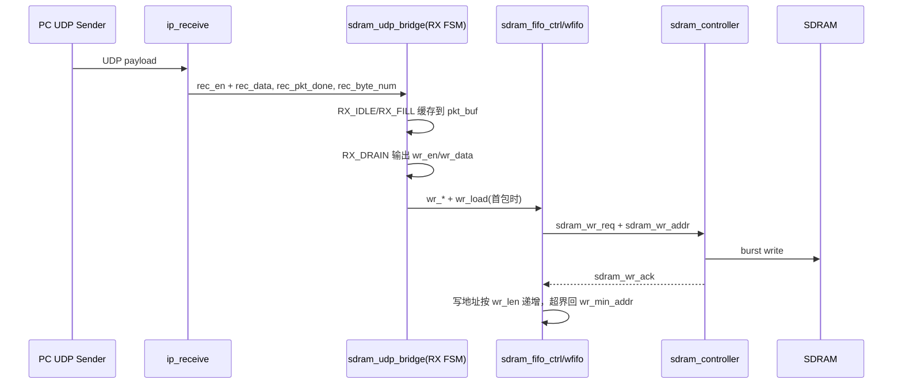
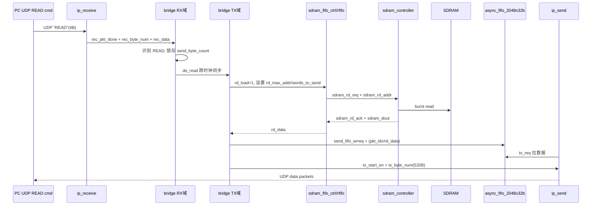

# FPGA 端 UDP 层级结构与 SDRAM 读写机制分析

## 1. 系统总体说明
当前工程的核心路径是：

- 写路径：PC 通过 UDP 发送数据 -> FPGA UDP 接收 -> 桥接模块整理后写入 SDRAM
- 读路径：PC 发送 `READ` 命令 -> FPGA 从 SDRAM 读出数据 -> UDP 回传给 PC

顶层模块为 `eth_pc_loop`，其职责是把时钟、UDP 子系统、桥接逻辑、SDRAM 控制以及调试显示连接起来。

---

## 2. UDP 层级结构图（模块层级）

---

## 3. 各模块功能说明

### 3.1 顶层与时钟
- **eth_pc_loop**：系统总装配模块，连接 UDP、桥接、SDRAM、显示和指示灯。
- **pll_clk**：由 50MHz 产生系统所需时钟（含 SDRAM 参考时钟与相移时钟）。

### 3.2 UDP 子系统
- **udp**：UDP/IP 收发封装模块，内部包含 `ip_receive`、`ip_send` 和 `crc32_d4`。
- **ip_receive**：MII 4bit 数据接收并解析 Ethernet/IP/UDP 头，输出有效负载到 `rec_data`。
- **ip_send**：组帧发送（Ethernet/IP/UDP + CRC），通过 `tx_req` 向上游请求发送数据。
- **crc32_d4**：发送端 CRC32 计算。

### 3.3 UDP 与 SDRAM 桥接
- **sdram_udp_bridge**：核心控制模块。
  - 接收 UDP 数据并写入 SDRAM。
  - 识别 4 字节读命令 `READ`（0x52454144）。
  - 触发 SDRAM 读取并把数据写入发送 FIFO，交给 UDP 发送端回传。

### 3.4 SDRAM 子系统
- **sdram_top**：SDRAM 用户端口与芯片控制接口的顶层。
- **sdram_fifo_ctrl**：读写 FIFO 管理 + 地址管理 + 读写请求仲裁（写优先）。
- **sdram_controller**：实际 SDRAM 时序控制。
- **sdram_wfifo / sdram_rfifo**：跨时钟域缓冲，分别用于写入路径和读出路径。

### 3.5 发送 FIFO 与调试
- **async_fifo_2048x32b**：桥接模块到 UDP 发送模块之间的数据 FIFO。
- **rec_pkt_counter / show_pkt_count**：接收包计数及数码管显示。

---

## 4. SDRAM 写入机制（UDP -> SDRAM）

### 写入过程要点
1. `ip_receive` 输出 `rec_en/rec_data`（32bit 数据流）和 `rec_pkt_done/rec_byte_num`（包结束信息）。
2. `sdram_udp_bridge` 在 RX 域状态机中先收包缓存，再在 DRAIN 阶段持续输出 `wr_en/wr_data`。
3. 在“本轮第一包”时拉高 `wr_load`，使 SDRAM 写地址回到 `wr_min_addr`，用于新一轮覆盖写。
4. `sdram_fifo_ctrl` 把写数据先放入 `sdram_wfifo`，当 FIFO 数据量达到突发长度 `wr_len` 后发起 SDRAM 突发写。
5. 写地址在 `[wr_min_addr, wr_max_addr]` 区间循环，形成环形写入。

---

## 5. SDRAM 读出机制（READ 命令触发）

### 读出过程要点
1. 读触发命令是 4 字节常量 `READ`（0x52454144）。
2. 桥接模块把累计写入字节数锁存，并同步到发送时钟域。
3. 读长度按固定包结构对齐：每包固定数据字数，回传包中还带包序号字段。
4. 从 SDRAM 读出的数据进入发送 FIFO，`ip_send` 通过 `tx_req` 按需取数并组帧发送。

---

## 6. 如果将写入源从 UDP 改为 GPIO，应如何修改

建议按“最小风险改造”进行：**保留现有 SDRAM 写口与 UDP 回传框架，只替换写入数据源接口**。

### 6.1 推荐方案 A（最小改动）
新增一个 `gpio_stream_adapter`，把 GPIO 采样数据转换成与 UDP 接收侧一致的接口：

- `rec_en`
- `rec_data[31:0]`
- `rec_pkt_done`
- `rec_byte_num`

然后在顶层增加源选择（例如 `SW[x]` 控制）：
- 选择 UDP：沿用 `u_udp` 的 `rec_*`
- 选择 GPIO：改接 `u_gpio_adapter` 的 `rec_*`

这样 `sdram_udp_bridge` 和 `sdram_top` 可以尽量不改。

### 6.2 建议改造点
1. **新增 GPIO 适配模块**
   - 将 GPIO 数据打包为 32bit。
   - 定义“包边界”（例如每 128 个字，或按外部同步信号分包）。
   - 在包结束时输出 `rec_pkt_done` 和正确的 `rec_byte_num`。

2. **顶层改接桥接输入**
   - 用 `src_rec_en/src_rec_data/src_rec_pkt_done/src_rec_byte_num` 中间信号接入 `sdram_udp_bridge`。
   - `src_rec_*` 由 UDP 或 GPIO 二选一。

3. **保留 READ 命令触发机制（推荐）**
   - 继续由 UDP 收到 `READ` 后触发 SDRAM 读回传。
   - 即“写入源可变（GPIO/UDP），读触发源仍为 UDP 命令”。

### 6.3 必须注意的设计点
1. **包边界语义**
   - 现有桥接逻辑是“按包写入”。GPIO 连续流必须定义分包规则。

2. **`wr_load` 的触发时机**
   - 新一轮采集开始时应拉高一次，用于复位写地址。

3. **写入长度统计**
   - `written_byte_count` 必须准确累计，否则读取长度会错。

4. **时钟域跨越**
   - GPIO 采样时钟若不同于桥接 RX 时钟，需要 CDC（建议异步 FIFO 或双触发同步 + 握手）。

---

## 7. 改造策略建议

- 如果目标是快速验证链路可用：先做方案 A（GPIO 适配成 `rec_*`）
- 如果后续会接多个采样源：再考虑把桥接模块拆分为“写入控制器”和“读回传控制器”两个独立模块

该策略可以在最小改动下保持现有 UDP 回传与 SDRAM 控制逻辑稳定。