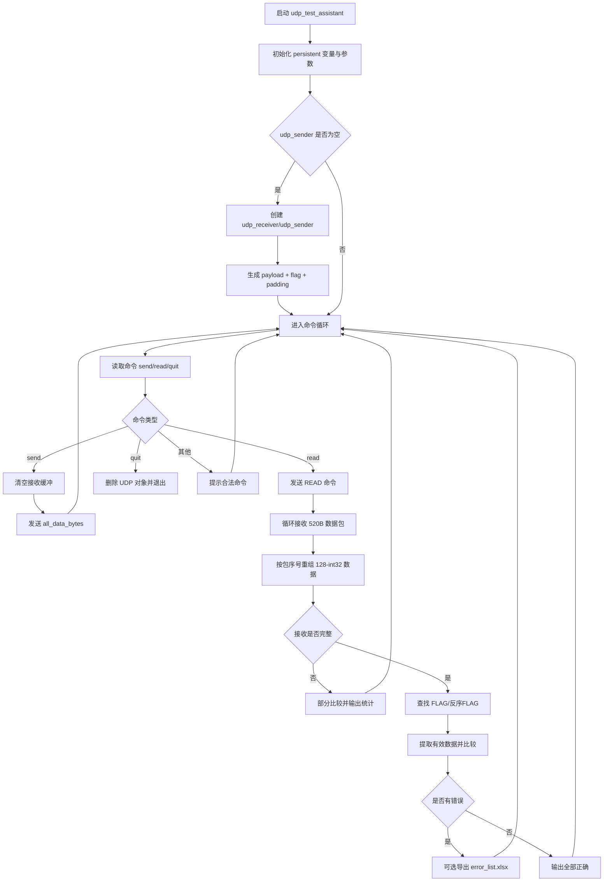

# udp_test_assistant.m 逐行解释文档

## 1) 程序作用
该函数是一个 MATLAB UDP 测试工具，用于：
- `send`：向 FPGA 发送带 `flag` 的 `int32` 数据（写入 SDRAM）
- `read`：请求 FPGA 从 SDRAM 回读数据并与原始数据比较
- `quit`：释放 UDP 资源并退出

## 2) 主流程图（Mermaid）

## 3) 逐行解释（按代码顺序）

> 说明：以下按“可执行语句/关键语句”逐行解释，连续换行（`...`）视作同一语句。

1. `function udp_test_assistant`  
   定义函数入口，无输入参数。

2. 注释块（功能说明）  
   描述 `send/read` 的测试目标。

3. `persistent udp_sender udp_receiver send_data all_data_bytes`  
   **持久化变量**，函数多次调用时保留状态（避免重复创建 UDP）。

4. `persistent num_int32_padded ... target_port`  
   持久化传输长度、分包参数、IP/端口等配置。

5. `local_ip = '192.168.1.102';`  
   本机绑定 IP。

6. `local_port = 1234;`  
   本机监听端口。

7. `target_ip = '192.168.1.123';`  
   FPGA 目标 IP。

8. `target_port = 1234;`  
   FPGA 目标端口。

9. `%num_int32 = 15999997;`  
   注释掉的固定测试长度。

10. `num_int32 = input('待传输的int32个数: ');`  
    交互输入有效载荷长度（单位：int32 个数）。

11. `num_int32_orig = num_int32;`  
    保存用户原始输入长度。

12. `num_int32_padded = 1024 * ceil((3 + num_int32_orig) / 1024);`  
    计算补齐后的总 int32 数，保证为 1024 的倍数（与包对齐策略匹配）。

13. `FLAG_INT32 = int32(2147483647);`  
    定义帧标志（`0x7FFFFFFF`）。

14. `MAX_ROWS_PER_SHEET = 1e6;`  
    Excel 导出时单表最大行数限制。

15. `int32_per_packet = 128;`  
    每个数据包有效载荷 128 个 int32。

16. `bytes_per_packet = int32_per_packet * 4;`  
    每包 512 字节（发送端设置）。

17. `num_packets = ceil(num_int32_padded / int32_per_packet);`  
    计算总包数。

18. `if isempty(udp_sender)`  
    首次运行才创建 UDP 对象并生成发送数据。

19. `fprintf(...)`（多行）  
    打印本地/目标地址与本次数据规模。

20. `udp_receiver = udpport('datagram', ...);`  
    创建 UDP 接收对象，绑定本地地址端口。

21. `udp_receiver.Timeout = 1.0;`  
    设置接收超时。

22. `catch ME ... return;`  
    接收对象创建失败则报错并退出函数。

23. `udp_sender = udpport('datagram', ... 'OutputDatagramSize', bytes_per_packet);`  
    创建 UDP 发送对象，输出报文大小设置为 512B。

24. `catch ME ... clear udp_receiver; return;`  
    发送对象创建失败，清理接收对象并退出。

25. `pause(0.2);`  
    给网络对象稳定时间。

26. `payload = int32(randi([...], num_int32_orig, 1));`  
    生成随机 int32 有效数据。

27. `pad_count = num_int32_padded - 1 - num_int32_orig;`  
    计算补零数量（减去 1 个 flag）。

28. `send_data = [FLAG_INT32; payload; zeros(...)]`  
    拼接完整发送向量：`flag + payload + zero padding`。

29. `all_data_bytes = typecast(send_data, 'uint8');`  
    int32 视图转换为字节流用于 UDP 发送。

30. `first_word = typecast(all_data_bytes(1:4), 'int32');`  
    回读首字检查 flag。

31. `if first_word ~= FLAG_INT32 ... warning(...)`  
    防止字节序或缓存异常。

32. `last_sent_int32 = num_int32_padded;`  
    记录最近一次发送总长度。

33. `fprintf('就绪...')`  
    提示可输入命令。

34. `while true`  
    进入命令循环。

35. `cmd = input(...,'s'); cmd = lower(strtrim(cmd));`  
    读取命令并标准化（去空格、小写）。

36. `if isempty(cmd), continue; end`  
    空命令直接下一轮。

37. `switch cmd`  
    分发 `send/read/quit/others`。

### case 'send'

38. `while ... udp_receiver.NumDatagramsAvailable > 0` + `read(...)`  
    尝试清空旧接收缓冲，防止脏包影响下一次 read。

39. `send_start = tic;`  
    发送计时开始。

40. `write(udp_sender, all_data_bytes, 'uint8', target_ip, target_port);`  
    一次性发送全部字节流到目标。

41. `last_sent_int32 = num_int32_padded;`  
    更新“最近发送长度”。

42. `catch ME ... continue;`  
    发送失败打印错误并回到命令循环。

43. `fprintf('发送完成...')`  
    输出发送耗时。

### case 'read'

44. `read_cmd = uint8([0x52 0x45 0x41 0x44]);`  
    生成 ASCII `"READ"` 命令。

45. `write(udp_sender, read_cmd, ...)`  
    通知板端回读 SDRAM。

46. `expected_int32 = last_sent_int32;`  
    期望回收长度按“最近发送”确定。

47. 长度不一致提示  
    防止修改参数后未重新 send 导致比较错位。

48. `INT32_PER_PKT = 128; PKT_BYTES = 520;`  
    接收按 RTL 协议：每包 520B（2 个序号字 + 128 数据字）。

49. `expected_packets = ceil(expected_int32 / INT32_PER_PKT);`  
    计算期望包数。

50. `recv_packets = cell(1, expected_packets);`  
    用 cell 按序号存每包的 128-int32 数据。

51. `recv_raw_bytes = cell(...)`  
    保存原始包字节（用于字节序诊断）。

52. 初始化统计变量（`packets_received`, `recv_start_time`, ...）  
    用于进度和超时控制。

53. `max_wait_time = ...`  
    根据数据量估算最大等待时长并限幅。

54. `while toc(start_wait_time) < max_wait_time`  
    在超时前持续收包。

55. `slots_filled = sum(cellfun(...))`  
    已按序填充的包数。

56. `if num_available > 0, data_struct = read(...)`  
    批量读取当前可用 UDP 报文。

57. 循环每个 datagram：`recv_bytes = data_struct(j).Data`  
    取单包数据。

58. `if length >= 520 && mod(length,4)==0`  
    基本合法性校验。

59. `b = reshape(...,4,[]); b = flipud(b); raw = typecast(...,'int32');`  
    每 4 字节翻转，处理网络序/端序差异后转 int32。

60. `seq = double(typecast(recv_bytes_vec(4:-1:1), 'uint32'));`  
    从包头提取包序号（1-based）。

61. `if seq >= 1 && seq <= expected_packets`  
    合法序号才入库。

62. `recv_raw_bytes{seq} = ...; recv_packets{seq} = raw(2:129);`  
    保存原始包和有效 128 字数据（丢弃首尾序号字）。

63. `packets_received = packets_received + 1;`  
    统计收到的包总数（含重复序号包）。

64. 进度输出（每 2,000,000 int32）  
    控制日志频率，避免刷屏。

65. 没包或异常时 `pause(0.001)`  
    降低 CPU 忙等占用。

66. 循环结束后计算 `recv_time` 并打印统计  
    输出耗时、总收包数、按序收齐包数。

67. `recv_data = zeros(expected_int32, 1, 'int32');`  
    预分配重组数组。

68. `for s = 1:expected_packets ... recv_data(...) = recv_packets{s}(1:n);`  
    按序号依次拼接有效数据。

69. `recv_data_index = min(slots_filled * INT32_PER_PKT, expected_int32);`  
    推算当前有效接收长度。

70. `if recv_data_index <= 0`  
    未收到数据，直接提示。

71. `elseif recv_data_index < expected_int32`  
    收到不完整：提示缺失并尝试“已收到部分”比较。

72. 部分比较逻辑：  
    - 在已收数据中找 `FLAG_INT32`  
    - 对齐后比较前 `n_eff` 个有效数据  
    - 输出错误数与正确率

73. `else`（完整接收）  
    进入完整对比流程。

74. `FLAG_SWAPPED = ... 'FFFFFF7F'`  
    定义反序 flag，用于端序异常兼容。

75. 查找 `FLAG_INT32`，找不到再找 `FLAG_SWAPPED`  
    若命中反序 flag，后续需要换字节序再比较。

76. 若未找到 flag 或后续长度不足  
    打印诊断信息（前 8 个数、flag 出现位置等）。

77. 提取 `recv_data_effective = recv_data(flag_pos + 1 : flag_pos + num_int32_orig);`  
    截取有效载荷段。

78. `if need_swap ... flipud ... typecast`  
    反序情况下对每个 int32 做字节翻转。

79. `send_data_compare = send_data(2 : 1 + num_int32_orig);`  
    取发送端有效数据（跳过首 flag）。

80. 行向量转列向量规范化  
    避免维度不一致导致误判。

81. `error_mask = (send_data_compare ~= recv_data_compare);`  
    逐元素比较并统计错误索引。

82. `fprintf('比较...正确率')`  
    输出比较结果。

83. `if num_errors > 0`  
    显示前 20 条错误样本。

84. 可选导出 `error_list`：  
    - 询问是否导出  
    - 输入起始行  
    - 限制导出行范围到 `MAX_ROWS_PER_SHEET`  
    - 生成 `table` 并 `writetable` 到 `error_list_时间戳.xlsx`

### case {'quit', 'exit', 'q'}

85. `fprintf('退出。')`  
    输出退出提示。

86. `delete(udp_receiver/udp_sender)`  
    释放 UDP 资源。

87. `clear udp_receiver udp_sender send_data all_data_bytes;`  
    清理变量。

88. `return;`  
    结束函数。

### otherwise

89. `fprintf('请输入 send、read 或 quit。')`  
    非法命令提示并继续循环。

90. `end`（多处）  
    结束 `switch/while/function` 结构。

## 4) 易踩坑

- `send` 端按 512B 发，`read` 端按 520B 收：这是协议设计差异，不是笔误。
- `persistent` 会保留旧状态，改参数后建议先 `quit` 再重启函数。
- 端序问题通过 `FLAG`/`FLAG_SWAPPED` 兼容，但仍建议板端和 MATLAB 明确统一字节序。
- `packets_received` 可能大于 `slots_filled`（重复包、乱序包导致）。
