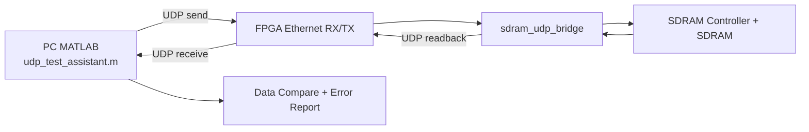

# eth_pc_loop (Quartus Project)

这是一个基于 Intel Quartus 的 FPGA 以太网/UDP 回环与 SDRAM 读写测试工程。

核心目标：
- PC 通过 UDP 将随机 `int32` 数据发送到 FPGA，写入 SDRAM
- FPGA 从 SDRAM 回读数据并通过 UDP 返回 PC
- MATLAB 脚本对回传数据进行完整性比较，并可导出错误列表

## 系统流程图



说明：
- 发送路径：PC 生成 flag + payload + padding，通过 UDP 发给 FPGA，写入 SDRAM。
- 回读路径：PC 发送 READ 命令，FPGA 从 SDRAM 读出并按包序回传。
- 校验路径：MATLAB 按 flag 对齐后比较原始数据与回传数据。

## 项目结构

```text
.
├─ eth_pc_loop.qpf / eth_pc_loop.qsf    # Quartus 工程与配置
├─ async_fifo_2048x32b.v                # FIFO 相关模块
├─ rtl/                                 # RTL 源码目录
├─ db/ incremental_db/ output_files/    # Quartus 编译数据库与输出
├─ udp_test_assistant.m                 # MATLAB UDP 测试脚本
├─ MATLAB.md                            # MATLAB 脚本逐行说明（含流程图）
└─ send.mat / stp2.stp / 其他工程文件
```

## 环境要求

- Windows（已在该环境下开发）
- Intel Quartus（与本工程版本兼容）
- MATLAB（支持 `udpport` 接口，推荐较新版本）
- FPGA 开发板（网口可用，SDRAM 控制逻辑可用）

## MATLAB 测试脚本说明

脚本文件：`udp_test_assistant.m`

功能命令：
- `send`：发送 `flag + payload + padding` 到 FPGA
- `read`：发送 `READ` 指令，接收 FPGA 回传数据并比较
- `quit`：关闭 UDP 对象并退出

详细逐行解释与 Mermaid 流程图见：`MATLAB.md`

## 快速开始

1. 打开 Quartus 工程并完成编译：
   - `eth_pc_loop.qpf`
2. 下载 bitstream 到 FPGA，确认网口链路正常。
3. 根据你的网络环境修改 `udp_test_assistant.m` 中 IP/端口：
   - `local_ip`
   - `target_ip`
4. 在 MATLAB 命令行运行：

```matlab
udp_test_assistant
```

5. 按提示输入待传输的 `int32` 数量，并使用：
   - `send`
   - `read`
   - `quit`

## 数据协议要点

- 发送端按 `int32` 组织数据：`FLAG(0x7FFFFFFF) + payload + zero padding`
- 发送分组逻辑按 128 个 `int32` 对齐
- 回读路径中单包按 RTL 协议解析（包含包序号和数据区）
- 脚本内置 flag 与端序兼容检查（含反序 flag 诊断）

## 当前联调状态

- 当前板上 bitstream 的 MATLAB 回读基线应采用 `raw(2:129)` 解析。
- 固定值 GPIO 回测已验证当前基线可工作。
- 递增值 GPIO 回测表明：从第 128 个点开始出现跨包整体偏移，问题已收敛到 Verilog 读回链路，而非 GPIO 数据生成本身。
- 当前重点排查对象为 `rtl/sdram_udp_bridge.v` 中按包读回的时序补偿逻辑。

详细问题收束、实验结论与下一步预案见：`CURRENT_DEBUG_STATUS.md`

## 常见问题

- 修改传输长度后，建议先 `quit` 再重启脚本，避免 `persistent` 状态干扰。
- 回传不完整时，会输出接收统计与局部比较结果。
- 发现错误后可导出 `error_list_时间戳.xlsx` 进行离线分析。

## 测试结果截图模板

建议在仓库中创建 `docs/images/` 目录并按下列占位命名截图文件，便于持续记录测试结果。

### 测试记录表

| 日期 | FPGA Bitstream | 数据规模 (int32) | 发送耗时 (s) | 回读耗时 (s) | 错误数 | 正确率 | 备注 |
| --- | --- | ---: | ---: | ---: | ---: | ---: | --- |
| 2026-04-14 | eth_pc_loop.sof | 10,000,000 | N/A | N/A | 0 | 100.000000% | 单次 10MPoints 回测通过（共 78,125 包，读回使用 udp_receive.m） |
| 2026-04-10 | eth_pc_loop.sof | 1,024 | 0.010 | 0.020 | 0 | 100.000000% | 基线测试 |
| YYYY-MM-DD | xxxxx.sof | N | T_send | T_read | E | P% | 例如：端序修复后 |

### 当前回测结论（2026-04-14）

- 当前工程在不修改代码条件下，单次 10,000,000 个 int32 回测可稳定通过。
- 本次回测读回阶段使用 MATLAB 脚本 `udp_receive.m`。
- 本次结论用于当前版本基线，后续若更改 RTL 或 MATLAB 脚本，建议重新回归测试并更新表格。

### 截图清单（占位）

1. MATLAB 控制台发送日志


2. MATLAB 回读比较结果日志


3. Quartus 编译摘要（可选）


4. SignalTap 波形（可选）


## 许可证

当前仓库未附带许可证文件。如需开源发布，建议补充 `LICENSE`（例如 MIT/BSD/GPL）。
